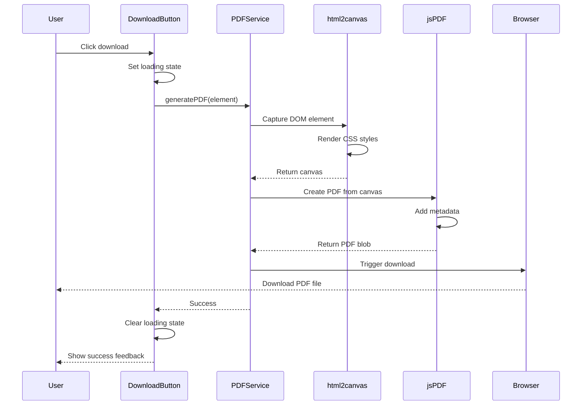

# Design Document: PDF Download Feature

## Overview

This design document outlines the implementation of a PDF download feature for a React portfolio/resume application. The solution uses html2canvas to capture the rendered HTML content and jsPDF to generate a PDF document, preserving all CSS styling including Tailwind classes, custom fonts, gradients, and layout.

The implementation follows a client-side approach, requiring no server infrastructure, and integrates seamlessly with the existing React + TypeScript + Vite application structure.

## Architecture

### High-Level Architecture

```
┌─────────────────────────────────────────────────────────┐
│                     React Application                    │
│  ┌────────────────────────────────────────────────────┐ │
│  │              Resume Container (App)                │ │
│  │  ┌──────────┐ ┌──────────┐ ┌──────────────────┐  │ │
│  │  │  Header  │ │ Summary  │ │ Professional Exp │  │ │
│  │  └──────────┘ └──────────┘ └──────────────────┘  │ │
│  │  ┌──────────┐ ┌──────────┐ ┌──────────────────┐  │ │
│  │  │  ProudOf │ │  Tech    │ │    Passions      │  │ │
│  │  └──────────┘ └──────────┘ └──────────────────┘  │ │
│  └────────────────────────────────────────────────────┘ │
│                           │                              │
│                           ▼                              │
│  ┌────────────────────────────────────────────────────┐ │
│  │          DownloadButton Component                  │ │
│  │  • Triggers PDF generation                         │ │
│  │  • Manages loading state                           │ │
│  │  • Handles errors                                  │ │
│  └────────────────────────────────────────────────────┘ │
│                           │                              │
└───────────────────────────┼──────────────────────────────┘
                            ▼
┌─────────────────────────────────────────────────────────┐
│              PDF Generation Service                      │
│  ┌────────────────────────────────────────────────────┐ │
│  │  1. html2canvas: Capture DOM as canvas            │ │
│  │     • Render all CSS styles                        │ │
│  │     • Preserve fonts, colors, gradients            │ │
│  │     • Handle responsive layout                     │ │
│  └────────────────────────────────────────────────────┘ │
│                           │                              │
│                           ▼                              │
│  ┌────────────────────────────────────────────────────┐ │
│  │  2. jsPDF: Convert canvas to PDF                  │ │
│  │     • Create PDF document                          │ │
│  │     • Add canvas as image                          │ │
│  │     • Handle pagination                            │ │
│  │     • Set metadata                                 │ │
│  └────────────────────────────────────────────────────┘ │
│                           │                              │
└───────────────────────────┼──────────────────────────────┘
                            ▼
                    Browser Download API
```

### Component Interaction Flow



## Components and Interfaces

### 1. DownloadButton Component

A React component that provides the user interface for triggering PDF downloads.

**Props Interface:**
```typescript
interface DownloadButtonProps {
  targetRef: React.RefObject<HTMLElement>;
  filename?: string;
  className?: string;
  onSuccess?: () => void;
  onError?: (error: Error) => void;
}
```

**Component Structure:**
```typescript
const DownloadButton: React.FC<DownloadButtonProps> = ({
  targetRef,
  filename = 'resume.pdf',
  className,
  onSuccess,
  onError
}) => {
  const [isGenerating, setIsGenerating] = useState(false);
  const [error, setError] = useState<string | null>(null);

  const handleDownload = async () => {
    // Set loading state
    // Call PDF service
    // Handle success/error
    // Clear loading state
  };

  return (
    // Button with loading state and accessibility attributes
  );
};
```

**Responsibilities:**
- Render download button with appropriate styling
- Manage loading and error states
- Trigger PDF generation via service
- Provide user feedback (loading, success, error)
- Handle accessibility (ARIA labels, keyboard navigation)

### 2. PDF Generation Service

A service module that encapsulates the PDF generation logic using html2canvas and jsPDF.

**Service Interface:**
```typescript
interface PDFGenerationOptions {
  element: HTMLElement;
  filename: string;
  scale?: number;
  format?: 'a4' | 'letter';
  orientation?: 'portrait' | 'landscape';
}

interface PDFGenerationResult {
  success: boolean;
  error?: Error;
  blob?: Blob;
}

const generatePDF = async (
  options: PDFGenerationOptions
): Promise<PDFGenerationResult> => {
  // Implementation
};
```

**Service Functions:**

1. **generatePDF(options)**: Main function to generate PDF
   - Validates input element
   - Configures html2canvas options
   - Captures DOM as canvas
   - Creates PDF using jsPDF
   - Triggers download
   - Returns result with success/error

2. **captureElement(element, options)**: Captures HTML element as canvas
   - Configures html2canvas with proper scale and options
   - Handles font loading
   - Preserves CSS styling
   - Returns canvas element

3. **createPDFFromCanvas(canvas, options)**: Converts canvas to PDF
   - Calculates optimal dimensions
   - Handles pagination for multi-page content
   - Adds PDF metadata
   - Returns PDF blob

4. **downloadPDF(blob, filename)**: Triggers browser download
   - Creates object URL from blob
   - Creates temporary anchor element
   - Triggers download
   - Cleans up resources

**Configuration:**
```typescript
const HTML2CANVAS_OPTIONS = {
  scale: 2, // Higher quality
  useCORS: true, // Handle external resources
  logging: false, // Disable console logs
  backgroundColor: '#ffffff',
  windowWidth: 1200, // Fixed width for consistency
  onclone: (clonedDoc: Document) => {
    // Modify cloned document for print optimization
    // Remove animations, adjust layout
  }
};

const JSPDF_OPTIONS = {
  format: 'a4',
  orientation: 'portrait',
  unit: 'mm',
  compress: true
};
```

### 3. Print Layout Optimization

A utility module to optimize the layout for PDF generation.

**Functions:**

1. **preparePrintLayout(element)**: Prepares element for PDF capture
   - Removes animations and transitions
   - Adjusts responsive classes for print
   - Ensures proper page breaks
   - Returns cleanup function

2. **cleanupPrintLayout(cleanup)**: Restores original layout
   - Reverts temporary changes
   - Re-enables animations

**Implementation:**
```typescript
const preparePrintLayout = (element: HTMLElement): (() => void) => {
  const originalClasses = element.className;
  const originalStyles = element.style.cssText;
  
  // Remove animation classes
  element.classList.remove('animate-fade-in', 'animate-fade-in-delay');
  
  // Set fixed width for consistency
  element.style.width = '1200px';
  element.style.maxWidth = 'none';
  
  // Return cleanup function
  return () => {
    element.className = originalClasses;
    element.style.cssText = originalStyles;
  };
};
```

### 4. Error Handling Module

Centralized error handling for PDF generation.

**Error Types:**
```typescript
enum PDFErrorType {
  ELEMENT_NOT_FOUND = 'ELEMENT_NOT_FOUND',
  CANVAS_GENERATION_FAILED = 'CANVAS_GENERATION_FAILED',
  PDF_CREATION_FAILED = 'PDF_CREATION_FAILED',
  DOWNLOAD_FAILED = 'DOWNLOAD_FAILED',
  BROWSER_NOT_SUPPORTED = 'BROWSER_NOT_SUPPORTED'
}

class PDFGenerationError extends Error {
  type: PDFErrorType;
  originalError?: Error;
  
  constructor(type: PDFErrorType, message: string, originalError?: Error) {
    super(message);
    this.type = type;
    this.originalError = originalError;
  }
}
```

**Error Handler:**
```typescript
const handlePDFError = (error: unknown): string => {
  if (error instanceof PDFGenerationError) {
    switch (error.type) {
      case PDFErrorType.ELEMENT_NOT_FOUND:
        return 'Could not find the resume content. Please refresh and try again.';
      case PDFErrorType.CANVAS_GENERATION_FAILED:
        return 'Failed to capture the resume layout. Please try again.';
      case PDFErrorType.PDF_CREATION_FAILED:
        return 'Failed to create PDF document. Please try again.';
      case PDFErrorType.DOWNLOAD_FAILED:
        return 'Failed to download PDF. Please check your browser settings.';
      case PDFErrorType.BROWSER_NOT_SUPPORTED:
        return 'Your browser does not support PDF downloads. Please use a modern browser.';
      default:
        return 'An unexpected error occurred. Please try again.';
    }
  }
  return 'An unexpected error occurred. Please try again.';
};
```

## Data Models

### PDF Generation State

```typescript
interface PDFGenerationState {
  isGenerating: boolean;
  progress: number; // 0-100
  error: string | null;
  lastGenerated: Date | null;
}
```

### PDF Configuration

```typescript
interface PDFConfig {
  filename: string;
  pageFormat: 'a4' | 'letter';
  orientation: 'portrait' | 'landscape';
  scale: number; // 1-3, higher = better quality but larger file
  includeMetadata: boolean;
  metadata?: {
    title: string;
    author: string;
    subject: string;
    keywords: string[];
  };
}

const DEFAULT_PDF_CONFIG: PDFConfig = {
  filename: 'resume.pdf',
  pageFormat: 'a4',
  orientation: 'portrait',
  scale: 2,
  includeMetadata: true,
  metadata: {
    title: 'Professional Resume',
    author: 'Resume Owner',
    subject: 'Professional Resume and Portfolio',
    keywords: ['resume', 'portfolio', 'professional']
  }
};
```

## Correctness Properties

*A property is a characteristic or behavior that should hold true across all valid executions of a system—essentially, a formal statement about what the system should do. Properties serve as the bridge between human-readable specifications and machine-verifiable correctness guarantees.*


### Property 1: PDF Generation Completeness
*For any* valid resume content, when the download button is clicked, the system should generate a PDF blob with the specified filename and trigger a browser download.
**Validates: Requirements 1.1, 1.3**

### Property 2: Page Format Compliance
*For any* PDF generation request, the generated PDF document should have dimensions matching the specified page format (A4 or Letter) in the specified orientation.
**Validates: Requirements 1.4**

### Property 3: CSS Style Preservation
*For any* HTML element with CSS styling (colors, fonts, spacing, borders, backgrounds), when captured by html2canvas, the resulting canvas should preserve the computed styles of that element.
**Validates: Requirements 1.2, 2.2, 2.4, 4.5**

### Property 4: Custom Font Preservation
*For any* text element using custom fonts (font-witt), when rendered in the PDF, the text should maintain the custom font appearance.
**Validates: Requirements 2.1**

### Property 5: Visual Effects Preservation
*For any* element with CSS visual effects (gradients, shadows, opacity), when captured by html2canvas, the resulting canvas should preserve these visual effects.
**Validates: Requirements 2.3**

### Property 6: Icon and SVG Preservation
*For any* SVG element or icon from Heroicons, when captured by html2canvas, the icon should be present and visually identical in the generated canvas.
**Validates: Requirements 2.5**

### Property 7: Loading State Transitions
*For any* PDF generation request, the system should transition through states in order: idle → loading (button disabled) → complete/error (button enabled), and the loading state should be active only while generation is in progress.
**Validates: Requirements 3.2, 3.3**

### Property 8: Error Message Display
*For any* PDF generation failure, the system should display a user-friendly error message that corresponds to the error type and provides actionable guidance.
**Validates: Requirements 3.4, 7.2**

### Property 9: Success Feedback
*For any* successful PDF generation, the system should provide visual confirmation to the user that the download completed successfully.
**Validates: Requirements 3.5**

### Property 10: Minimum Resolution Quality
*For any* PDF generation, the canvas scale factor should be at least 2 (equivalent to 150+ DPI) to ensure clear text rendering.
**Validates: Requirements 4.1**

### Property 11: PDF Metadata Inclusion
*For any* generated PDF document, the PDF should include metadata fields (title, author, creation date) with appropriate values.
**Validates: Requirements 4.4**

### Property 12: Error Logging
*For any* PDF generation failure, the system should log error details (error type, message, stack trace) for debugging purposes.
**Validates: Requirements 7.1**

### Property 13: Error Recovery
*For any* failed PDF generation, when the user retries, the system should reset the error state, clear the loading state, and attempt generation again.
**Validates: Requirements 7.3**

### Property 14: Browser Feature Detection
*For any* browser environment, if required features (canvas, blob, download API) are not supported, the system should detect this and display an appropriate error message.
**Validates: Requirements 5.4, 7.5**

### Property 15: Download Blocking Handling
*For any* scenario where the browser blocks the download, the system should detect this and provide instructions to the user on how to allow the download.
**Validates: Requirements 7.4**

### Property 16: Non-Blocking UI
*For any* PDF generation operation, the operation should be asynchronous and not block the main UI thread, allowing user interaction during generation.
**Validates: Requirements 6.2**

### Property 17: Progress Indicator Display
*For any* PDF generation that takes longer than 2 seconds, the system should display a progress indicator to inform the user that processing is ongoing.
**Validates: Requirements 6.3**

### Property 18: Keyboard Accessibility
*For any* interaction with the download button, the button should be operable via keyboard (Enter or Space key) and should respond identically to click events.
**Validates: Requirements 8.1**

### Property 19: ARIA Label Presence
*For any* render of the download button, the button should have appropriate ARIA labels (aria-label or aria-labelledby) that describe its purpose for screen reader users.
**Validates: Requirements 8.2**

### Property 20: Loading State Announcement
*For any* loading state change, the system should update an ARIA live region to announce the status change to screen reader users.
**Validates: Requirements 8.3**

### Property 21: Color Contrast Compliance
*For any* color combination used in the download button, the contrast ratio between foreground and background should meet or exceed WCAG 2.1 AA standards (4.5:1 for normal text, 3:1 for large text).
**Validates: Requirements 8.4**

### Property 22: Focus Indicator Visibility
*For any* focus state on the download button, a visible focus indicator should be present with sufficient contrast to be easily distinguishable.
**Validates: Requirements 8.5**

## Error Handling

### Error Categories

1. **Element Not Found**: Target element for PDF generation doesn't exist
   - Detection: Check if ref.current is null before generation
   - Handling: Display error message, log error, prevent generation attempt
   - User Action: Refresh page and try again

2. **Canvas Generation Failed**: html2canvas fails to capture element
   - Detection: Catch errors from html2canvas promise
   - Handling: Log error details, display user-friendly message
   - User Action: Try again, check browser compatibility

3. **PDF Creation Failed**: jsPDF fails to create document
   - Detection: Catch errors from jsPDF operations
   - Handling: Log error details, display user-friendly message
   - User Action: Try again, reduce content complexity

4. **Download Failed**: Browser blocks or fails to download
   - Detection: Catch errors from download trigger
   - Handling: Provide instructions to allow downloads
   - User Action: Check browser settings, allow downloads

5. **Browser Not Supported**: Required APIs not available
   - Detection: Feature detection on component mount
   - Handling: Display compatibility message
   - User Action: Use a modern browser (Chrome, Firefox, Safari, Edge)

6. **Library Loading Failed**: html2canvas or jsPDF fails to load
   - Detection: Catch import/loading errors
   - Handling: Display error message, suggest refresh
   - User Action: Check network connection, refresh page

### Error Handling Strategy

```typescript
try {
  // Validate element exists
  if (!targetElement) {
    throw new PDFGenerationError(
      PDFErrorType.ELEMENT_NOT_FOUND,
      'Resume content not found'
    );
  }

  // Prepare layout
  const cleanup = preparePrintLayout(targetElement);

  try {
    // Generate canvas
    const canvas = await html2canvas(targetElement, HTML2CANVAS_OPTIONS);
    
    // Create PDF
    const pdf = await createPDFFromCanvas(canvas, pdfConfig);
    
    // Trigger download
    await downloadPDF(pdf, pdfConfig.filename);
    
    // Success
    return { success: true, blob: pdf };
    
  } finally {
    // Always cleanup
    cleanup();
  }
  
} catch (error) {
  // Log error
  console.error('PDF generation failed:', error);
  
  // Convert to user-friendly message
  const userMessage = handlePDFError(error);
  
  // Return error result
  return {
    success: false,
    error: error instanceof Error ? error : new Error(String(error))
  };
}
```

### Retry Logic

```typescript
const handleRetry = () => {
  // Reset error state
  setError(null);
  
  // Reset loading state
  setIsGenerating(false);
  
  // Wait for state update, then retry
  setTimeout(() => {
    handleDownload();
  }, 100);
};
```

## Testing Strategy

### Dual Testing Approach

This feature requires both unit tests and property-based tests to ensure comprehensive coverage:

**Unit Tests** focus on:
- Specific examples of PDF generation with known content
- Edge cases (empty content, very large content, special characters)
- Error conditions (missing element, library failures)
- Integration points (button click → service → download)
- Browser API mocking and verification

**Property-Based Tests** focus on:
- Universal properties that hold for all inputs
- Style preservation across random content
- State transitions across various scenarios
- Error handling across different error types
- Accessibility compliance across different states

Together, these approaches provide comprehensive coverage: unit tests catch concrete bugs in specific scenarios, while property tests verify general correctness across a wide range of inputs.

### Property-Based Testing Configuration

We will use **fast-check** (already in package.json) for property-based testing. Each property test will:
- Run a minimum of 100 iterations to ensure thorough coverage
- Generate random but valid inputs (resume content, configurations, states)
- Verify the property holds for all generated inputs
- Be tagged with a comment referencing the design document property

Tag format: `// Feature: pdf-download-feature, Property {number}: {property_text}`

### Test Structure

```typescript
// Unit Tests
describe('DownloadButton', () => {
  it('should render with correct accessibility attributes', () => {
    // Test specific example
  });
  
  it('should handle click and trigger PDF generation', () => {
    // Test specific interaction
  });
  
  it('should display error message when generation fails', () => {
    // Test specific error case
  });
});

describe('PDFService', () => {
  it('should generate PDF for typical resume content', () => {
    // Test specific example
  });
  
  it('should handle empty content gracefully', () => {
    // Test edge case
  });
  
  it('should include metadata in generated PDF', () => {
    // Test specific requirement
  });
});

// Property-Based Tests
describe('PDF Generation Properties', () => {
  // Feature: pdf-download-feature, Property 1: PDF Generation Completeness
  it('should generate PDF blob for any valid resume content', () => {
    fc.assert(
      fc.asyncProperty(
        fc.record({
          name: fc.string(),
          title: fc.string(),
          experience: fc.array(fc.record({
            company: fc.string(),
            role: fc.string(),
            duration: fc.string()
          }))
        }),
        async (resumeData) => {
          // Generate PDF from random resume data
          // Verify blob is created
          // Verify download is triggered
        }
      ),
      { numRuns: 100 }
    );
  });
  
  // Feature: pdf-download-feature, Property 7: Loading State Transitions
  it('should transition through states correctly for any generation request', () => {
    fc.assert(
      fc.asyncProperty(
        fc.boolean(), // success or failure
        async (shouldSucceed) => {
          // Track state transitions
          // Verify: idle → loading → complete/error
          // Verify button disabled during loading
        }
      ),
      { numRuns: 100 }
    );
  });
  
  // Feature: pdf-download-feature, Property 21: Color Contrast Compliance
  it('should maintain WCAG AA contrast for any button color scheme', () => {
    fc.assert(
      fc.property(
        fc.record({
          background: fc.hexaString({ minLength: 6, maxLength: 6 }),
          foreground: fc.hexaString({ minLength: 6, maxLength: 6 })
        }),
        (colors) => {
          // Calculate contrast ratio
          // Verify meets WCAG AA (4.5:1)
        }
      ),
      { numRuns: 100 }
    );
  });
});
```

### Testing Tools and Libraries

- **Vitest**: Test runner (already configured)
- **@testing-library/react**: Component testing utilities
- **@testing-library/jest-dom**: DOM matchers
- **fast-check**: Property-based testing library
- **jsdom**: DOM environment for testing

### Test Coverage Goals

- Unit test coverage: 80%+ for all components and services
- Property test coverage: All 22 correctness properties implemented
- Integration test coverage: Key user flows (click → generate → download)
- Accessibility test coverage: All WCAG requirements verified

### Mock Strategy

For testing, we will mock:
- **html2canvas**: Return mock canvas with predictable dimensions
- **jsPDF**: Return mock PDF object with verifiable methods
- **Browser Download API**: Capture download calls without triggering actual downloads
- **DOM Elements**: Use @testing-library to render and query components

Example mocks:
```typescript
// Mock html2canvas
vi.mock('html2canvas', () => ({
  default: vi.fn((element, options) => {
    const canvas = document.createElement('canvas');
    canvas.width = 1200;
    canvas.height = 1600;
    return Promise.resolve(canvas);
  })
}));

// Mock jsPDF
vi.mock('jspdf', () => ({
  jsPDF: vi.fn().mockImplementation(() => ({
    addImage: vi.fn(),
    save: vi.fn(),
    output: vi.fn(() => new Blob(['mock pdf'], { type: 'application/pdf' })),
    setProperties: vi.fn()
  }))
}));
```

## Implementation Notes

### Library Installation

```bash
npm install html2canvas jspdf
npm install --save-dev @types/html2canvas
```

### Integration with Existing App

The download button should be added to the App component, positioned prominently (e.g., top-right corner or below the header). The button will receive a ref to the main resume container.

```typescript
// In App.tsx
const resumeRef = useRef<HTMLDivElement>(null);

return (
  <div ref={resumeRef} className="container mx-auto...">
    <DownloadButton 
      targetRef={resumeRef}
      filename="professional-resume.pdf"
      className="fixed top-4 right-4"
    />
    {/* Existing content */}
  </div>
);
```

### Performance Considerations

1. **Lazy Loading**: Load html2canvas and jsPDF only when needed (on first download attempt)
2. **Debouncing**: Prevent rapid repeated clicks during generation
3. **Canvas Caching**: Consider caching canvas for repeated downloads (with invalidation on content change)
4. **Web Workers**: For very large resumes, consider using Web Workers for canvas processing (future enhancement)

### Browser Compatibility

- **Chrome/Edge**: Full support, best performance
- **Firefox**: Full support, good performance
- **Safari**: Full support, may have font rendering differences
- **Mobile Browsers**: Limited support, may need alternative approach or warning

### Known Limitations

1. **Text Selectability**: html2canvas converts to image, so PDF text won't be selectable (trade-off for perfect CSS preservation)
2. **File Size**: Image-based PDFs are larger than text-based PDFs
3. **External Resources**: Images from external domains require CORS headers
4. **Animations**: Animations are captured at a single moment in time
5. **Print Media Queries**: CSS print media queries are not automatically applied (need manual handling)

### Future Enhancements

1. **Multiple Format Options**: Allow user to choose between image-based and text-based PDF
2. **Custom Styling**: Allow user to customize PDF appearance (margins, colors)
3. **Multi-page Optimization**: Better handling of page breaks and multi-page content
4. **Progress Tracking**: More granular progress updates during generation
5. **Batch Download**: Generate multiple versions (different formats) simultaneously
